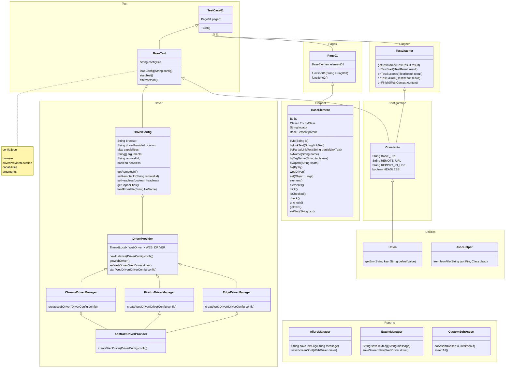

```mermaid
---
config:
  layout: drage
---
classDiagram
direction BT

AbstractDriverProvider --|> ChromeDriverManager
AbstractDriverProvider --|> FirefoxDriverManager
AbstractDriverProvider --|> EdgeDriverManager

ChromeDriverManager --|> DriverProvider
FirefoxDriverManager --|> DriverProvider
EdgeDriverManager --|> DriverProvider

DriverProvider --|> DriverConfig

DriverConfig --|> BaseTest

Constants --|> BaseTest

Constants --|> TestListener

Ulties --|> Constants

BaseElement --|> Page01

BaseTest --|> TestCase01

Page01 --|> TestCase01

TestListener --|> TestCase01

note for BaseTest "config.json<br><br>browser<br>driverProviderLocation<br>capabilities<br>arguments"

	namespace Driver {
        class AbstractDriverProvider {
            createWebDriver(DriverConfig config)
        }

        class ChromeDriverManager {
            createWebDriver(DriverConfig config)
        }

        class FirefoxDriverManager {
            createWebDriver(DriverConfig config)
        }

        class EdgeDriverManager {
            createWebDriver(DriverConfig config)
        }

        class DriverConfig {
            String browser;
            String driverProviderLocation;
            Map<String, Object> capabilities;
            String[] arguments;
            String remoteUrl;
            boolean headless;

	        getRemoteUrl()
	        setRemoteUrl(String remoteUrl)
            setHeadless(boolean headless)
            getCapabilities()
            loadFromFile(String fileName)
        }

        class DriverProvider {
            ThreadLocal< WebDriver > WEB_DRIVER

            newInstance(DriverConfig config)
            getWebDriver()
            setWebDriver(WebDriver driver)
            startWebDriver(DriverConfig config)
        }

	}

	namespace Element {
        class BaseElement {
            By by
            Class< ? > byClass
            String locator
            BaseElement parent

            byId(String id)
            byLinkText(String linkText)
            byPartialLinkText(String partialLinkText)
            byName(String name)
            byTagName(String tagName)
            byXpath(String xpath)
            by(By by)

            webDriver()

            set(Object... args)
            element()
            elements()
            click()
            isChecked()
            check()
            uncheck()
            getText()
            setText(String text)
        }

	}
    
	namespace Pages {
        class Page01 {
            BaseElement element01

            function01(String string001)
            function02()
        }

	}

	namespace Test {
        class BaseTest {
            String  configFile

	        loadConfig(String config)
	        startTest()
	        afterMethod()
        }

        class TestCase01 {
            Page01 page01

            TC01()
        }

	}

    namespace Listener {
        class TestListener {
	        getTestName(ITestResult result)
            onTestStart(ITestResult result)
            onTestSuccess(ITestResult result)
            onTestFailure(ITestResult result)
            onFinish(ITestContext context)
        }
    }

    namespace Configuration {
        class Constants {
            String BASE_URL
            String REMOTE_URL
            String REPORT_IN_USE
            boolean HEADLESS
        }
	}

    namespace Ultilities {
        class JsonHelper {
            fromJsonFile(String jsonFile, Class<T> clazz)
        }

        class Ulties {
            getEnv(String key, String defaultValue)
        }
	}

    namespace Reports {
        class AllureManager {
            String saveTextLog(String message)
            saveScreenShot(WebDriver driver)
        }

        class ExtentManager {
            String saveTextLog(String message)
            saveScreenShot(WebDriver driver)
        }

        class CustomSoftAssert {
            doAssert(IAssert<?> a, int timeout)
            assertAll()
        }
	}
```
